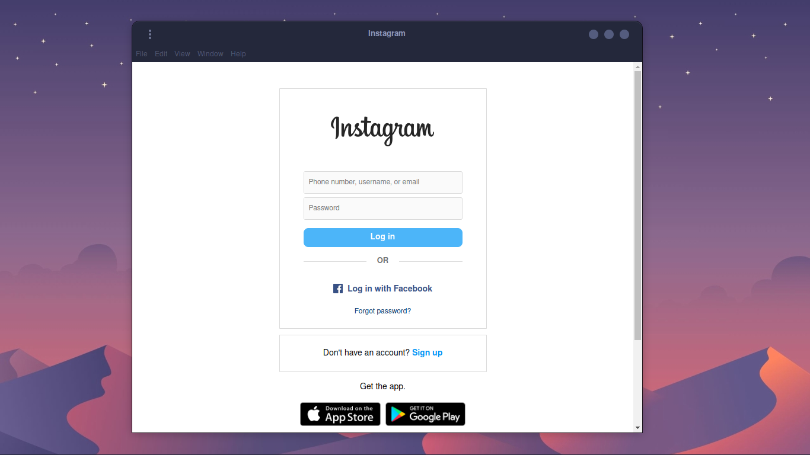

<!DOCTYPE html>
<html lang="en">
<head>
  <meta charset="UTF-8">
</head>
<body>
  <h1>Instagram Client For Linux</h1>
  
This is an Instagram client application built using Electron, which allows you to browse Instagram on your desktop.

  <h2>Installation</h2>
  
To install the Instagram client, please follow these steps:

  <ol>
    <li>Download the latest release from the <a href="https://github.com/praveen3164/Instagram-Client-For-Linux/releases/tag/Client_Releases">releases page</a> on GitHub..</li>
    <!-- <li>Install dependencies using the following command: <code>npm install</code></li>
    <li>Start the application using the following command: <code>npm start</code></li> -->

  

  
<b><code>Client Screenshot</code></b>

  <h3>Blue Theme</h3>

  

  

  </ol>
  <h2>Usage</h2>
  
Once you have started the application, you will be presented with the Instagram login page. Enter your credentials to log in to your Instagram account.

  
You will then be able to browse your Instagram feed, search for users, view profiles, and interact with posts.

  <h2>Development</h2>
  
If you would like to contribute to the development of this project, please follow these steps:

  <ol>
    <li>Fork this repository.</li>
    <li>Clone your forked repository to your local machine.</li>
    <li>Create a new branch for your changes.</li>
    <li>Make your changes.</li>
    <li>Commit your changes.</li>
    <li>Push your changes to your forked repository.</li>
    <li>Create a pull request to merge your changes into the main repository.</li>
  </ol>
  <h2>License</h2>
  
This project is licensed under the MIT License - see the <a href="LICENSE">LICENSE</a> file for details.

</body>
</html>
